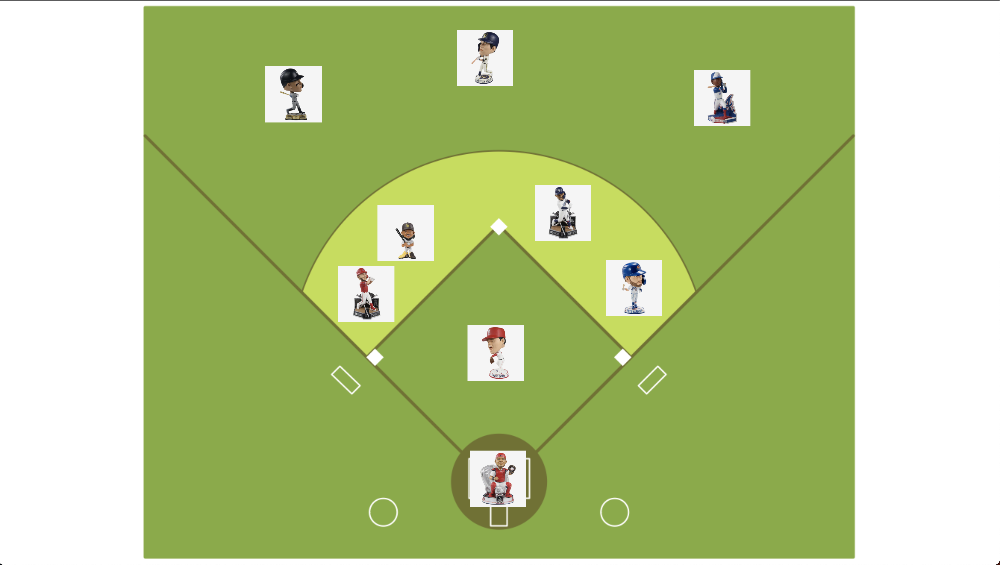

# Corkboard App

<div>

A cool new way to organize elements and allow users to move them around your page or within a compenent/div.

</div>

<div>

## Getting Started

After forking this repo, install all dependencies: "react-dnd", "react-dnd-html5-backend" via

```
npm install
```

</div>

<div>

## Screenshots

|| |
|| :------------------------------------------------: |
| Inital State|  |
| Lineup Set|  |

</div>
<div>

## How to Use

- To change the background image update .App in the App.css file.

- It is currently setup to allow the entire screen size to drag and drop elements. To adjust the allowable size, line 18 & 19, holds the width and height.

- To change the images, go to App.js and update

```
const [images, setImages] = ([
    { url: "your-image-here", x: x-pos, y: y-pos }
])
```

- This is also where you define the position of each image upon the initial render.

</div>

<div>

## How It Works?

- Beginning at the bottom I created 'ImageElement.jsx'. Using React's hooks 'useState' and 'useRef', we need to keep track of weather the element (in our case an image) is being dragged or not and its position.

  - First, id, url, x, y, moveImage, and containerRef need to be deconstructed.
  - The app needs to handle events such as when the mouse clicks down, when it unclicks (mouseUp), and when the mouse moves around.
  - Needs to track its relative position as to how much it moved and where iet stopped moving.
  - Added a little styling for once the image has been grabbed to change from pointer to a grab cursor.

- Second is to create the container of this function/app by creating Corkboard.jsx

  - Here, import { useDrop } from react-dnd and the ImageElement that was previously created.
  - Need to deconstruct the 'images' and 'moveImage' being passed from App.jsx and create a containerRef using useRef.
  - Next we use the useDrop() hook which returns an array containing a ref to attach to the Drop Target node and the collected props. This allows you to specify what can or cannot be dropped.
  - Then we return the referenced node, styles (if any), and the images array map with the ImageElement component.

* Last step is to wrap the 'Corkboard' inside the 'DndProvider' and pass along HTML5Backend, the images, and moveImage.

```
      <DndProvider backend={HTML5Backend}>
        <Corkboard images={images} moveImage={moveImage} />
      </DndProvider>
```
